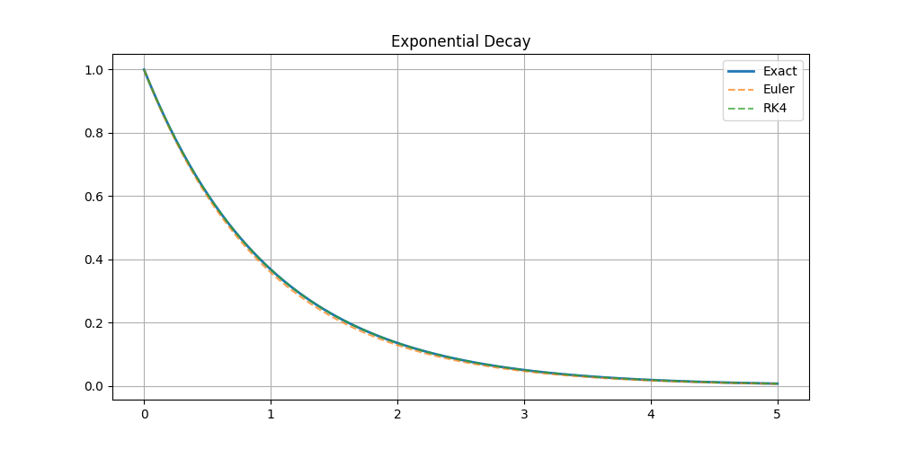
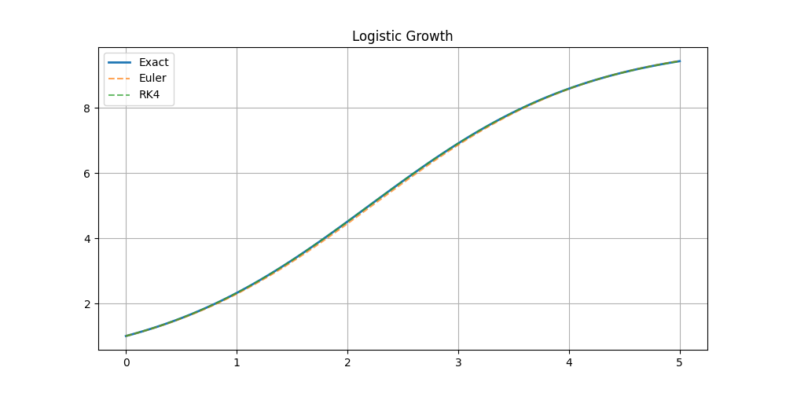
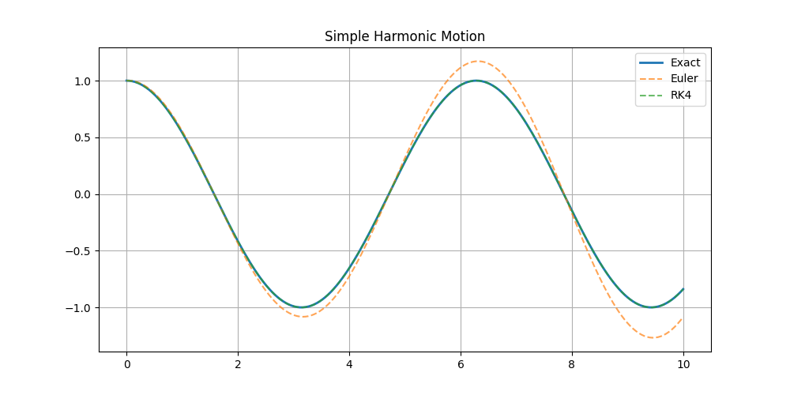
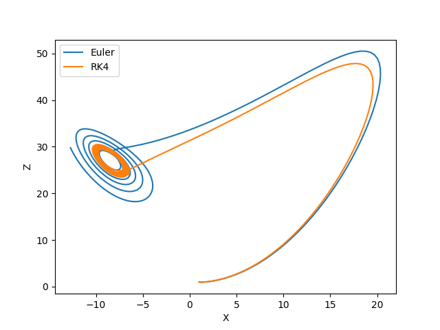
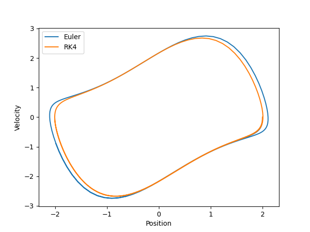

# Numerical Solutions of Ordinary Differential Equations

## Overview
This project implements numerical methods for solving ordinary differential equations (ODEs), specifically using the **Euler method** and **RK4 method**. Various ODEs are analyzed, including:

- **Exponential Decay**
- **Logistic Growth**
- **Simple Harmonic Motion (SHM)**
- **Lorenz System** (Chaotic System)
- **Van der Pol Oscillator**

## Methods Used
- **Euler's Method**: A simple but less accurate first-order method.
- **RK4 (Runge-Kutta 4th Order Method)**: A more accurate higher-order method.

## Dependencies
Ensure you have the following Python libraries installed:
```bash
pip install numpy matplotlib
```

## Results & Plots

### 1. Exponential Decay
Exponential decay follows the equation:
```latex
$$ y' = -y $$
```
The numerical solutions compared against the exact solution:



### 2. Logistic Growth
Logistic growth follows the equation:
```latex
\( y' = y(1 - \frac{y}{10}) \)
```


### 3. Simple Harmonic Motion (SHM)
Equation:
```latex
$$ y'' + y = 0 $$
```


### 4. Lorenz System
A chaotic system described by:
```latex
\[ \begin{aligned} 
    x' &= \sigma(y - x) \\
    y' &= x(\rho - z) - y \\
    z' &= xy - \beta z 
\end{aligned} \]
```


### 5. Van der Pol Oscillator
A nonlinear oscillator described by:
```latex
$$ y'' - \mu(1 - y^2)y' + y = 0 $$
```


## Error Analysis
The table below summarizes the errors in numerical methods:

```latex
\begin{table}[h]
    \centering
    \begin{tabular}{|l|c|c|c|} \hline
    Method & L2 Error & Max Error & RMSE \\ \hline
    Euler (Exponential Decay) & 0.000570 & 0.009489 & 0.005696 \\ \hline
    RK4 (Exponential Decay) & 0.000000 & 0.000000 & 0.000000 \\ \hline
    Euler (Logistic Growth) & 0.003789 & 0.064599 & 0.037889 \\ \hline
    RK4 (Logistic Growth) & 0.000000 & 0.000000 & 0.000000 \\ \hline
    Euler (SHM) & 0.008573 & 0.269985 & 0.121248 \\ \hline
    RK4 (SHM) & 0.000000 & 0.000000 & 0.000000 \\ \hline
    Euler (Lorenz) & 0.087143 & 6.420071 & 2.755716 \\ \hline
    Euler (Van der Pol) & 0.020209 & 0.812551 & 0.285801 \\ \hline
    \end{tabular}
    \caption{Numerical Errors for Different Methods}
    \label{tab:errors}
\end{table}

```

## Project Report
[View](report/main.pdf)

## To be done:
- Adding PDE solvers
- Using PETSc for solving
- Error Analysis using Taylor Series

